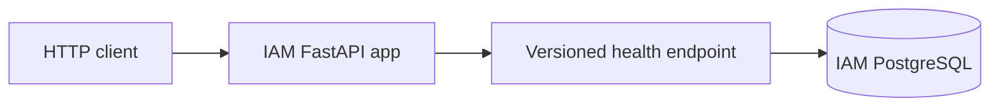

# SmartHire

Backend for TalentSphere Inc.'s workforce orchestration and recruitment platform.
The project requirements cover core recruitment workflows (Part A) and later
AI-assisted retrieval and assistants (Part B).

## Current repository

```text
smart-hire/
├── services/
│   ├── iam-service/           # runnable FastAPI foundation and local PostgreSQL config
│   ├── job-service/           # empty main.py and README placeholders
│   ├── candidate-service/     # FastAPI foundation and local PostgreSQL config
│   └── application-service/   # empty main.py and README placeholders
├── docs/
│   ├── concept/              # four preserved source requirements documents
│   └── db-schema.md           # per-service database design
├── AGENTS.md
└── smart-hire.code-workspace
```

IAM currently provides configuration, async database infrastructure, logging, error
handling, and a versioned health endpoint. Authentication and recruitment business
APIs, workflows, events, analytics, and AI capabilities are not implemented yet.

## IAM foundation

See [IAM setup, API, and development commands](services/iam-service/README.md).

## Candidate foundation

See [candidate setup, API, and development commands](services/candidate-service/README.md).
Candidate-service provides the same settings, database-session, logging/middleware, and
health foundation. Its API runs locally on port 8001, with PostgreSQL on host port 5433.
Candidate models, migrations, profiles, resumes, and ownership enforcement remain future work.

The proposed [complete per-service database design](docs/db-schema.md) covers IAM,
jobs, candidates, and applications. IAM models, repositories, and an initial Alembic
migration are written; authentication and service logic remain unimplemented. Other
services' domain schemas remain design documentation.



The scaffold uses Python 3.12, FastAPI, Pydantic settings, async SQLAlchemy with asyncpg,
PostgreSQL, uv, ruff, pytest, and Docker Compose. Future request handlers will follow
endpoint → service → repository → model. Those extension layers currently have no
business implementation. Database transactions for IAM business operations remain
undefined until those operations are built.

## Requirements and delivery

The source documents live in [docs/concept](docs/concept/). They specify PostgreSQL,
a NoSQL database, Redis, Celery/RabbitMQ, Kafka/Schema Registry, Temporal, and
observability tooling for the wider platform, plus the Part B AI stack. This scaffold
does not integrate those additional systems. Vendor choices and product policies
remain open where the sources do not settle them.
