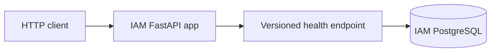

# SmartHire

Backend for TalentSphere Inc.'s workforce orchestration and recruitment platform.
The project requirements cover core recruitment workflows (Part A) and later
AI-assisted retrieval and assistants (Part B).

## Current repository

```text
smart-hire/
├── services/
│   ├── iam-service/           # runnable FastAPI foundation and local PostgreSQL config
│   ├── job-service/           # empty main.py and README placeholders
│   ├── candidate-service/     # empty main.py and README placeholders
│   └── application-service/   # empty main.py and README placeholders
├── docs/
│   ├── concept/              # four preserved source requirements documents
│   └── iam-service-structure.md
├── AGENTS.md
└── smart-hire.code-workspace
```

IAM currently provides configuration, async database infrastructure, logging, error
handling, and a versioned health endpoint. Authentication and recruitment business
APIs, workflows, events, analytics, and AI capabilities are not implemented yet.

## IAM foundation

See [IAM setup, API, and development commands](services/iam-service/README.md) and
[the structure replication plan](docs/iam-service-structure.md).

The proposed [complete per-service database design](docs/db-schema.md) covers IAM,
jobs, candidates, and applications, with [PostgreSQL DDL](docs/schema/) and access-policy
templates. It is design documentation; domain tables and migrations are not implemented.



The scaffold uses Python 3.12, FastAPI, Pydantic settings, async SQLAlchemy with asyncpg,
PostgreSQL, uv, ruff, pytest, and Docker Compose. Future request handlers will follow
endpoint → service → repository → model. Those extension layers currently have no
business implementation. Database transactions for IAM business operations remain
undefined until those operations are built.

## Requirements and delivery

The source documents live in [docs/concept](docs/concept/). They specify PostgreSQL,
a NoSQL database, Redis, Celery/RabbitMQ, Kafka/Schema Registry, Temporal, and
observability tooling for the wider platform, plus the Part B AI stack. This scaffold
does not integrate those additional systems. Vendor choices and product policies
remain open where the sources do not settle them.
