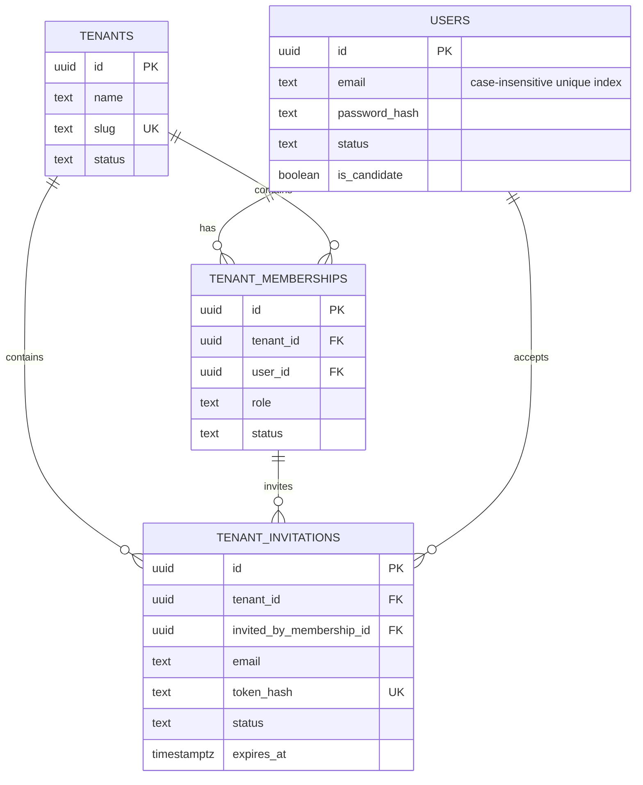
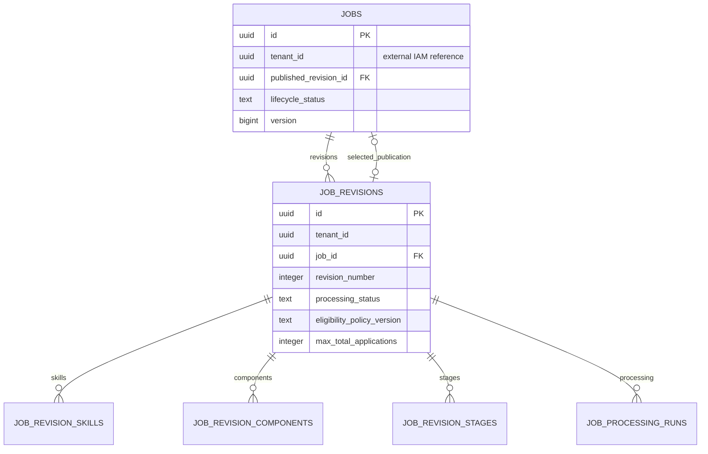
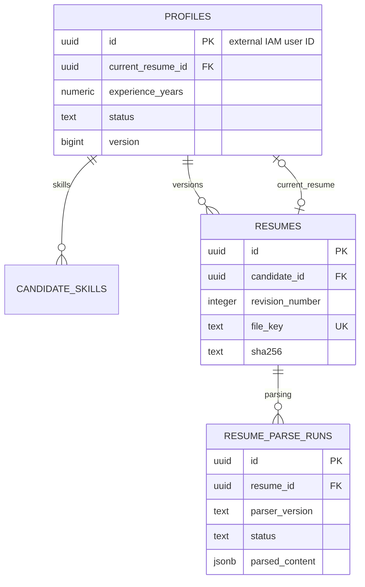
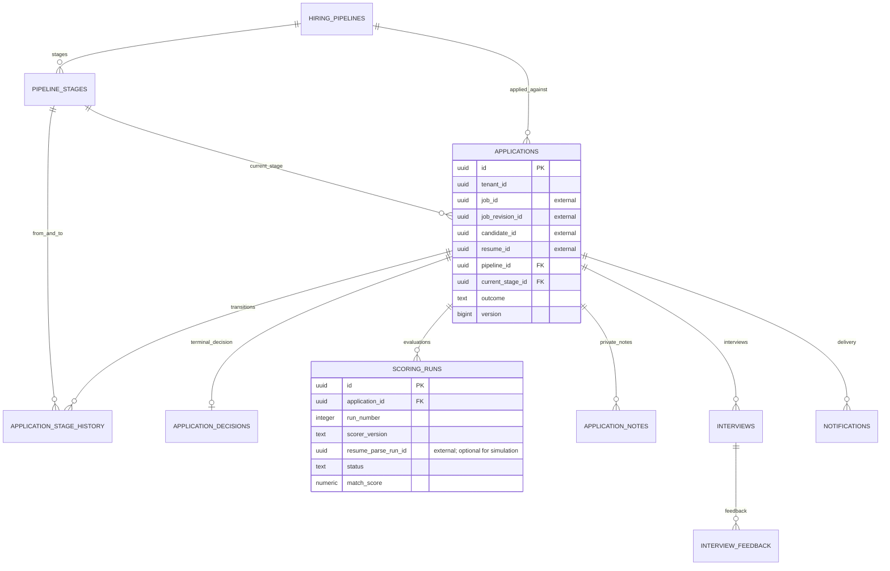
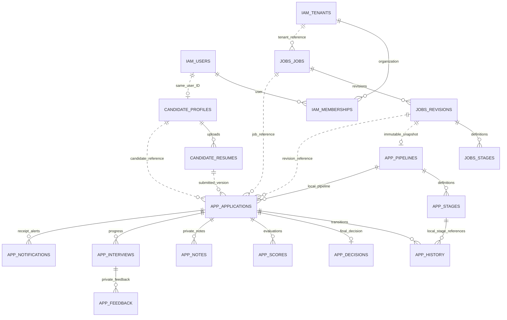

# SmartHire — database schema design, Part A

Status: proposed relational design and PostgreSQL 16+ DDL, not implemented models or migrations.
The design follows the discussion's accepted decisions and the assignment's Part A requirements.
The original documents in `docs/concept/` remain unchanged.

## Scope and decisions

Four service-owned PostgreSQL databases, with no cross-database foreign keys, shared tables,
or direct reads of another service's database. This is an architectural choice, not an
assignment requirement. All local relationships use ordinary relational constraints.

| Decision | Design |
| --- | --- |
| Identity versus organization | Global users; many-to-many tenant memberships; candidate access is independent |
| IAM event boundary | No outbox, inbox, or domain-event publisher in IAM |
| Job updates | Immutable source revisions after processing starts; each publication selects a ready revision |
| Application state | Current state plus append-only transitions and a terminal decision |
| Pipeline ownership | Immutable local pipeline snapshot per job revision in application-service |
| Duplicate application | One application per `(tenant_id, job_id, candidate_id)`; no application idempotency-key column |
| Resume versions | Immutable file versions; profile points to a current version for future submissions |
| Scoring | Stable run identity for retries; a new run for deliberate rescoring |
| Tenant isolation | Composite parent/child FKs plus RLS; separate candidate-own-data read policies |
| Four-service scope | Notification delivery and reporting are modules/workers in application-service |
| Part B | Embeddings, vector indexes, assistants, and their usage storage deferred |

The user calls the posting service `jobs-service`; the repository currently uses
`services/job-service`. This document and SQL use `jobs-service`; no directory was renamed.
The pasted earlier architecture had six services. Its notification/KPI deployment boundaries
are superseded here by the requested four-service scope; worker pools can scale independently
without introducing additional service databases.

Tenant onboarding, invitation flows, MongoDB activity storage, and S3 storage came from the
supplied design, not the assignment. MongoDB/S3 remain design selections, not integrations.
This baseline has no platform administrator and no autonomous hiring decisions.

## Files and database ownership

Each DDL file targets a separate NEW database and contains a transaction. Execute no file
against an existing database without converting the design into reviewed migrations.
IDs are UUIDs generated by the owning service. `updated_at`, version increments, and immutable
record protections require service logic; there are no automatic timestamp triggers.

| Owner | Main tables | DDL |
| --- | --- | --- |
| IAM | `users`, `tenants`, `tenant_memberships`, `tenant_invitations` | [iam-service.sql](schema/iam-service.sql) |
| Candidate | `profiles`, `candidate_skills`, `resumes`, `resume_parse_runs` | [candidate-service.sql](schema/candidate-service.sql) |
| Jobs | `jobs`, `job_revisions`, revision skills/components/stages, `job_processing_runs` | [jobs-service.sql](schema/jobs-service.sql) |
| Application | pipelines/stages, applications/history/decisions, scoring, notes, interviews/feedback, notifications, capacity counters | [application-service.sql](schema/application-service.sql) |
| Candidate, Jobs, Application | Each owns its own `outbox_events` and `processed_events` | Included in its DDL |
| Application reporting module | Five projection/synchronization tables; three views in `reporting` | Included in application DDL |

Exact columns, types, nullability, checks, keys, and indexes are defined in the linked SQL.
String-valued states use `text` with CHECK constraints for a simple migration baseline.
This is a proposed set of states; transitions still need domain validation.
All timestamps use `timestamptz`. Reporting windows use explicit UTC boundaries initially.
No blanket 3NF claim is made: snapshots, JSON processing artifacts, and reporting projections
are intentional representations of historical or derived data.

## IAM database

| Table | Purpose and important constraints |
| --- | --- |
| `users` | Account identity, hashed password, account status, candidate capability; normalized email uniqueness |
| `tenants` | Customer organizations; unique lowercase slug; active/inactive status |
| `tenant_memberships` | Recruiter capability in an organization; unique `(tenant_id, user_id)`; one user can belong to several organizations |
| `tenant_invitations` | Optional architecture onboarding capability; hashed invitation secret, expiration, same-tenant inviter FK, pending-email uniqueness |

`is_candidate` grants candidate capability; it is not mutually exclusive with membership.
Membership roles are `owner` and `recruiter`. Organization creation assigns the creator
an `owner` membership. Platform administration remains a separate, unimplemented capability.
Who may invite is still a product policy; schema membership does not itself authorize inviting.
Invitation expiry is checked during acceptance; an expired pending invitation must be marked
expired/revoked before issuing a replacement because the partial index cannot depend on `now()`.

Organization signup commits tenant, user if new, and membership in one IAM transaction.
Invitation acceptance validates token/expiry and creates or activates membership atomically.
Candidate registration sets candidate capability. A separate authenticated candidate-service
request creates the profile idempotently; a failure leaves a valid account awaiting profile creation.
IAM never creates another service's rows or emits a registration event.

Access JWTs include user identity, candidate capability, and organization memberships/roles.
Organization requests select a tenant using `X-Tenant-ID`, checked against the signed memberships.
Candidate requests do not require a tenant. Access tokens expire after 15 minutes; the accepted
tradeoff is that changed membership claims can remain usable until expiry. Refresh issuance must
load current account/organization/membership state. There is no `/auth/context` endpoint.
Refresh sessions, password-reset flows, and JWKS private-key storage are outside this schema scope;
private signing keys are deployment secrets, not plaintext user-table fields.

## Jobs database

| Table | Purpose and important constraints |
| --- | --- |
| `jobs` | Stable posting identity, creator, publication pointer, lifecycle, aggregate version |
| `job_revisions` | Title/description, location/employment, eligibility configuration, optional JD object key; unique revision number per job; at most one editable draft |
| `job_revision_skills` | Canonical skill key, display name, required flag, nonnegative scoring weight; unique key per revision |
| `job_revision_components` | Ordered requirement/responsibility/benefit items; unique type and position per revision |
| `job_revision_stages` | Ordered stage definitions; unique stage key/position per revision; explicit `kind` for reporting |
| `job_processing_runs` | Stable Temporal workflow reference, processor version, progress/failure visibility, attempt count; unique processor run per revision |

Lifecycle: `draft → open → closed → archived` is the proposed normal path.
Reopening and restoring archived jobs are not included until agreed.
Revision processing: `draft → processing → ready` or `failed`; failed processing can retry
against the same frozen inputs. Source fields and stage definitions freeze at `frozen_at`.
Processing writes computed skills/components to the targeted revision; successful output is
immutable. Reprocessing with changed source creates another revision.

Publishing locks the job and targeted revision, verifies required outputs and stages exist,
sets the revision ready, changes the publication pointer/lifecycle, increments the job version,
and inserts an outbox event in one transaction. Intermediate activity results cannot publish it.
The publication pointer's composite FK prevents selecting another job/tenant's revision.
**Readiness itself is a cross-row service invariant, not enforced by that FK.**

Existing published content remains available while another revision processes (proposal).
Compensation discards/retries derived output; it does not delete frozen source or old publication.
Every failed/retried activity writes only to its revision and logical run.
Search uses a PostgreSQL GIN expression index over title/description; embeddings are deferred.

`max_total_applications` is a nullable proposed per-job lifetime acceptance limit, not a
reinterpretation of an agreed product rule. NULL disables this limit. New revision limits
apply to subsequent acceptances without resetting historical accepted count. Other limits,
including global candidate quotas and time-window limits, remain undefined.

## Candidate database

| Table | Purpose and important constraints |
| --- | --- |
| `profiles` | One global profile per IAM user; candidate-managed data, status, aggregate version, current resume pointer |
| `candidate_skills` | Mutable profile skills; normalized unique skill key per candidate |
| `resumes` | Immutable uploaded-file identity/metadata/checksum; unique candidate revision number |
| `resume_parse_runs` | Versioned parsing result, status/attempts/errors; unique `(resume_id, parser_version)` |

The profile's composite resume FK prevents selecting someone else's resume. NULL is permitted
until an upload exists. Updating the current pointer never changes prior applications.
Allocate resume revision numbers while locking the profile row; do not use an unlocked MAX+1.
Each profile/skill/current-resume change increments profile version and commits its event with it.

File upload and PostgreSQL commit are not atomic. Upload a new object with a never-reused key,
verify its metadata, then commit the resume row/pointer/event. Clean up orphaned uploads later;
never overwrite an object referenced by an application. Supported formats and size limits remain
open. The same upload retry must reuse its reserved resume ID/object key, not create a fresh version.
No application-level idempotency-key column is introduced by this file-upload requirement.

Candidate-service owns canonical parsing results. Its parser can run as a worker and exposes
successful results through its API. Application scoring may wait/retry for a specific parse run;
it never writes candidate-service's tables. Week 3 simulated scoring does not require parsing.
Successful parses and submitted resume content remain immutable; a changed parser gets another run.
Profile edits do not retroactively change eligibility: accepted facts are captured on the application.

Profiles are globally owned, not globally readable. Only the authenticated candidate edits their
profile. Recruiter access to a submitted resume requires authorization against the relevant
application through service APIs. There is no unrestricted recruiter profile listing in this design.

## Application database

| Table | Purpose and important constraints |
| --- | --- |
| `hiring_pipelines` | One immutable local stage-definition snapshot per tenant/job/revision |
| `pipeline_stages` | Local stage rows shared by applications on that revision; unique position and source stage |
| `applications` | Immutable submission references, eligibility evidence, current stage/outcome, concurrency version, workflow and selected score |
| `application_stage_history` | Append-only transitions with ordered sequence, actor/system attribution, time and reason |
| `application_decisions` | One terminal hired/rejected/withdrawn decision; actor, reason, time |
| `scoring_runs` | Logical run number, scorer/parser/configuration versions, result and retry status; scores 0–100 |
| `application_notes` | Recruiter-private notes; never included in candidate responses |
| `interviews` | Minimal interview progress: application/pipeline stage, schedule, mode, status, completion |
| `interview_feedback` | Private feedback, one row per interview/interviewer; rating scale 1–5 is proposed |
| `notifications` | Durable asynchronous application notification intent and delivery outcome; deduplicated by source fact, recipient and template/channel |
| `job_application_counters` | Atomic accepted count per tenant/job, across revisions |

Composite FKs enforce application/pipeline/job/revision agreement, same-pipeline current/history
stages, tenant-consistent parent/child records, and a selected score belonging to its application.
Checks tie terminal outcomes to `finalized_at`. Decision/outcome agreement and successful selected
scores are cross-row transaction invariants and must be enforced by service commands.

### Submission transaction and limits

1. Authenticate candidate, derive user ID from JWT, and look for an existing application first.
2. If found, return it when immutable submitted data agrees; reject changed resume/input with 409.
   Never mutate the original or send another notification. Reapplication to the same job is excluded.
3. Through owning-service APIs, validate account/profile, resume ownership, open job, published
   revision, and eligibility. Preserve minimal checked facts and policy/profile versions in
   `eligibility_snapshot`; do not copy entire resumes or unrelated personal data into events.
4. Create/reuse an immutable local pipeline snapshot. Check initial stage and required structure.
5. In one application transaction, create/reuse and lock the job capacity-counter row, recheck
   duplicates and any configured lifetime limit, insert application + initial history, increment
   capacity count, insert initial scoring run and application-submitted outbox event.
6. Commit before responding. Capacity is never consumed by a duplicate or rejected submission.

The authoritative count lives in application-service. Check and increment while holding its row
lock; an unlocked count-then-insert is unsafe. Accepted lifetime counts do not decrease on withdrawal.
Uniqueness is `(tenant_id, job_id, candidate_id)`, independent of job/resume revision.
If another request wins insertion, retry/read in a new transaction and return the existing result.
Never use ON CONFLICT DO UPDATE to overwrite historical submission fields.

There is no atomic transaction across jobs/candidate/application databases. This baseline accepts
against the open published revision observed during validation; job closure/update immediately
before local commit does not invalidate that acceptance. Strict admission at the exact closure
instant would require an agreed reservation protocol or moving admission ownership. This is an
explicit proposed consistency contract, not a solved cross-service atomicity guarantee.

### Current state, history, decisions and scoring

Lock application → verify expected stage/version and allowed transition → update current stage
and version → append unique sequence → outbox event → commit. `version` is a concurrency counter,
not a content revision. Initial history is NULL → submitted. A terminal decision writes its row,
updates outcome/finalized timestamp/version, and emits the event in the same transaction. Terminal
outcomes are final in this baseline; corrections/reopening require a later policy and design.

A pipeline begins with one submitted stage, has unique ordered positions, and at least one stage.
Default progression is increasing position; skipping/backtracking need explicit future rules.
`kind=interview` identifies interview conversion even if the display name is customized.
Hired/rejected/withdrawn are outcomes, not required pipeline stage definitions.

Scoring run S1 identifies application A1, hence immutable resume R1 and job revision J1. A worker
retry keeps S1. An intentional rescore allocates S2 under the application lock, even with the same
scorer version. Freeze successful result/configuration. A real scorer references one canonical
parse run and parser version; simulation leaves both NULL. External parse identity/ownership must
be validated through the candidate API. A successful selected-score pointer is changed explicitly,
not chosen by arrival order. This is input provenance, not a promise that all future AI is deterministic.

Minimal interviews support progress and conversion; calendar booking, interviewer assignment,
conflict detection, and external scheduling are not modeled. Verify stage kind is interview in
service logic. Assessments are omitted because their subsystem scope has not been agreed.

### Notification module

The notification consumer atomically records processed event + notification intent, then commits.
A separate Celery worker performs provider I/O. Retry the same notification ID. Use that ID as
a provider idempotency token where supported. A provider timeout after accepting delivery is
`unknown`, not proof of failure; reconcile with the provider before resending. PostgreSQL/Kafka
alone cannot guarantee exactly-once external email. Template versions and minimal delivery data
preserve the intended message. No invitation notification flow is silently added to event-free IAM.

## Complete cross-service relationship map

Solid relationships below are local FKs; dashed relationships are external IDs. Infrastructure
and reporting tables are covered by their SQL rather than expanding this domain diagram.

Same-database FK targets are deliberately repeated composite UNIQUE keys where necessary.
External IDs are validated at command time and never enforced by cross-database FKs.
No ON DELETE CASCADE is introduced: historical submissions, stages, resumes, and decisions must
not disappear when an account/job changes. Soft deactivation is the baseline; legal retention,
erasure/anonymization, and blob deletion policies still require agreement.

## Infrastructure tables and execution boundaries

| Table/system | Responsibility |
| --- | --- |
| `outbox_events` | Event ID, aggregate/version/type/schema, tenant where applicable, payload, correlation, occurred/published timestamps, retry visibility |
| `processed_events` | Unique `(consumer_name, event_id)` committed with each consumer's database effect |
| Temporal | Durable workflow execution/history; business state still lives in owning PostgreSQL tables |
| Celery/RabbitMQ | Background execution; task IDs are not the durable business source of truth |
| Redis | Cache, rate limits, optional short-lived locks; never the only protection against duplicate effects |
| MongoDB | Proposed append-only activity sink; no source-of-truth recruitment state |
| Object storage | Immutable resume/JD objects; database holds stable keys and resume metadata |

Jobs/candidate/application changes commit with their own outbox records. IAM is the explicit
exception to the earlier architecture's “outbox per writing service” wording.
Publish at least once, keyed by aggregate ID. Consumers deduplicate durably and update projections
only for newer aggregate versions. Multiple logical consumers inside application-service need
separate consumer names/groups when each needs the full stream; one shared group would distribute
messages rather than broadcast them to every module.

Outbox relay ordering requires serial publication per aggregate/version; plain parallel polling
is not enough. A crash after broker acknowledgement can redeliver an event. The relay's own
published timestamp is not proof that every consumer has processed it.

Application creation durably records workflow/scoring intent. A dispatcher starts the stable
Temporal workflow ID from the submitted fact and enqueues the already-created scoring run.
To avoid recording an event as processed and losing task enqueue afterward, use a durable pending
run scanner (claim/lease/recovery) or transactional dispatch intent. Duplicate tasks are harmless
only when workers lock/check the same run and complete its effects once. Failed jobs are retriable
with stable run IDs; leases/worker recovery belong to implementation, not another competing state machine.
Failure events are optional business facts; operational failure counters go to Prometheus.

## Reporting inside application-service

There is no separate KPI database/service. The `reporting` schema contains only the data needed
to join external facts with application-owned authoritative records.

| Object | Source and purpose |
| --- | --- |
| `identity_sync_batches` | Complete, consistent IAM snapshot marker and synchronization status |
| `user_snapshots` | User ID/status/candidate capability for one batch; no identity PII |
| `membership_snapshots` | Membership and tenant status for that batch |
| `current_users`, `current_memberships` views | Read only the latest completed batch; never partially imported identity data |
| `candidate_profiles` | Versioned profile-status projection from candidate events |
| `jobs` | Versioned publication/status/creator projection from jobs events |
| `application_facts` view | Application submission/outcome, first interview-stage entry, and decision time from local tables |

The IAM reporting API is proposed and not implemented. Its paginated export must have a stable
snapshot token, or changing pages can miss/duplicate membership data. Import users and memberships,
then mark a batch completed only after validating completeness. An unsuccessful import leaves the
previous completed generation active. Expired generations need internal cleanup.

Candidate/job projections initialize through authenticated bulk APIs and then consume versioned
facts. Export/stream bootstrapping needs a replay boundary and version-aware upsert so concurrent
changes are not lost; reconcile periodically and retain deactivation facts. Record freshness and
lag, not just latest processing time. No IAM events are required.

Applications are already local, so the fact view avoids maintaining another duplicate application
state. Start with queries and appropriate indexes; introduce daily materialized summaries only
when measurements justify them. The view uses security-invoker behavior in PostgreSQL 16.

| Required metric | Data / proposed calculation | Definition still to agree |
| --- | --- | --- |
| Total candidates | Distinct current active IAM candidate accounts joined to existing profile projection | “Active” proposed as enabled account, not recent login; whether inactive profiles count |
| Total recruiters | Distinct active accounts/memberships joined to jobs they manage | Creator of at least one open job is a baseline proxy; management/assignment and historical scope need agreement |
| Total jobs published | Jobs with lifecycle open and non-NULL published revision | Active posting definition; revision publication must not double-count jobs |
| New applications over time | Count local `submitted_at` in UTC half-open daily/weekly/monthly windows | Reporting timezone; week start |
| Application-to-interview rate | Applications in submission cohort with first interview-stage entry / all applications in cohort | Stage entry versus scheduled/completed interview; follow-up cutoff |
| Average time to hire | Sum(final decision time − submitted time) / qualifying final decisions | Source says application-to-final-decision; whether rejected decisions belong must be agreed |
| Most-applied jobs | Count applications grouped by tenant/job | Reporting window and closed jobs |
| Average applications per candidate | Applications in window / agreed candidate population | Include zero-application candidates or only applicants; active population snapshot |
| Failed workflows/system errors | Prometheus counters by component/operation/error category; task tables support diagnosis | Exhausted failure versus failed attempt versus currently failed |
| AI assistant usage | Deferred Part B telemetry/storage | Query/summary semantics and retention |

Current total counts are gauges derived from state, not monotonically increasing event counters.
Never average daily averages without their sample counts. Conversion counts applications, not
interview rows. A candidate who has three interviews contributes once. A reopened job would still
be one job if that policy is later added. No metric silently substitutes hired-only duration for
the source's final-decision wording.

Global candidate counts are platform figures. An organization's candidate pool instead means
candidates with its applications and must be labeled separately. Tenant recruiter counts dedupe
within the organization; platform counts dedupe users across memberships, not sum tenant totals.
Recruiter reporting endpoints filter tenant IDs derived from membership and expose aggregates;
the internal reporting role is not an added human platform-admin role.

## RLS and authorization deployment

[Jobs policies](schema/jobs-service-rls.sql) and [application policies](schema/application-service-rls.sql)
are separate deployment templates. They require role-management privileges and run after their
matching DDL on a fresh cluster/database. They are not idempotent migration scripts.
NOLOGIN group roles need separately provisioned login roles. Migration owners, public readers,
tenant handlers, candidate readers, internal reporting, and relay access are distinct.

Runtime roles have no ownership or BYPASSRLS. Tenant tables enable and force RLS. Set context with
`SELECT set_config('app.tenant_id', :validated_tenant_id, true)` within the current transaction;
candidate reads similarly set `app.user_id`. Missing context denies access. API code, not a client
parameter, sets context. Custom settings do not authenticate a database client by themselves.

Public job readers see only open jobs and their selected ready revision/children. Recruiters see
their tenant's draft/published records. Candidate application readers see their own application,
its pipeline and status history, but not notes, feedback, scores, notifications, or decision reasons.
Candidate response schemas must strip private history reasons/actor details even though trusted
backend code can read the underlying row. Submission uses the trusted tenant command path after
validating candidate identity and target job; it never takes tenant ID from a candidate JWT.

Internal reporting policies read only the local application tables needed for aggregation;
identity/profile projections stay behind the reporting module. Relays get only outbox read/update
access across tenants. Candidate-service enforces resource ownership through APIs; it does not
receive cross-tenant unrestricted recruiter access merely because its schema is global.

SQL provides structural integrity. Service commands must enforce legal transitions, readiness,
immutable source/history/results, allowed actors, selected-score success, complete pipelines,
consistent decisions, and external ownership. Grant templates must be narrowed further during
implementation; RLS limits rows, not business transitions or column edits.

## Assignment traceability and build order

| Milestone | Schema foundation |
| --- | --- |
| Week 1 | IAM identities/memberships, candidate profiles/skills/resumes, jobs/revisions/stages; no claim that auth is assignment-prescribed |
| Week 2 | Frozen revision publishing, application uniqueness/eligibility/limits, local pipeline/history/decisions, transactional workflow intent |
| Week 3 | Outbox/inbox consumers, simulated scoring, notification delivery, reporting/reconciliation, logs/traces/metrics |
| Week 4–5 | Extend immutable job/resume sources with embeddings/index provenance and assistant interactions; no AI DDL included now |

Open product decisions are marked above: quota semantics, strict closure races, active/management
metric definitions, actor permissions/invitations, terminal corrections, stage skips/backtracking,
interview expansion, notification provider, file formats/retention, token revocation and Part B vendors.
The SQL encodes proposed defaults for review; it does not turn them into assignment requirements.

## Technical references and validation

The design uses established PostgreSQL features rather than a custom persistence mechanism:
composite keys/FKs for local relationships, uniqueness for duplicate submissions, and CHECKs for
row-level validity. Cross-row business invariants require service transactions or additional
reviewed database enforcement. See [PostgreSQL 16 constraints](https://www.postgresql.org/docs/16/ddl-constraints.html).
RLS controls row visibility with role policies; see [row security](https://www.postgresql.org/docs/16/ddl-rowsecurity.html)
and [CREATE POLICY](https://www.postgresql.org/docs/16/sql-createpolicy.html).
Repeated inserts can use conflict handling without replacing original data; see
[INSERT / ON CONFLICT](https://www.postgresql.org/docs/16/sql-insert.html).

Validation performed:

- All six SQL files parsed successfully with `pglast` 8.4 (installed only in a temporary
  validation directory; no project dependency was added).
- A static catalog check found 36 tables and verified all 31 local foreign keys: source/target
  columns exist, types agree, and referenced column combinations have a PRIMARY KEY or UNIQUE
  constraint. No foreign key targets another service database.
- `git diff --check` passed for tracked edits; the new artifacts were also checked for trailing
  whitespace. Policy DO blocks use dynamic SQL; parser success alone does not execute or prove
  those generated policies.

There is no local PostgreSQL installation and the Docker daemon was unavailable in this session.
Creation on PostgreSQL, example-data behavior, RLS under provisioned login roles, and concurrent
transaction/retry scenarios remain unverified. Those are implementation checks to perform when
migrations and runtime commands exist. No application models, migrations, tables, containers,
or integrations have been deployed by creating these design artifacts.
